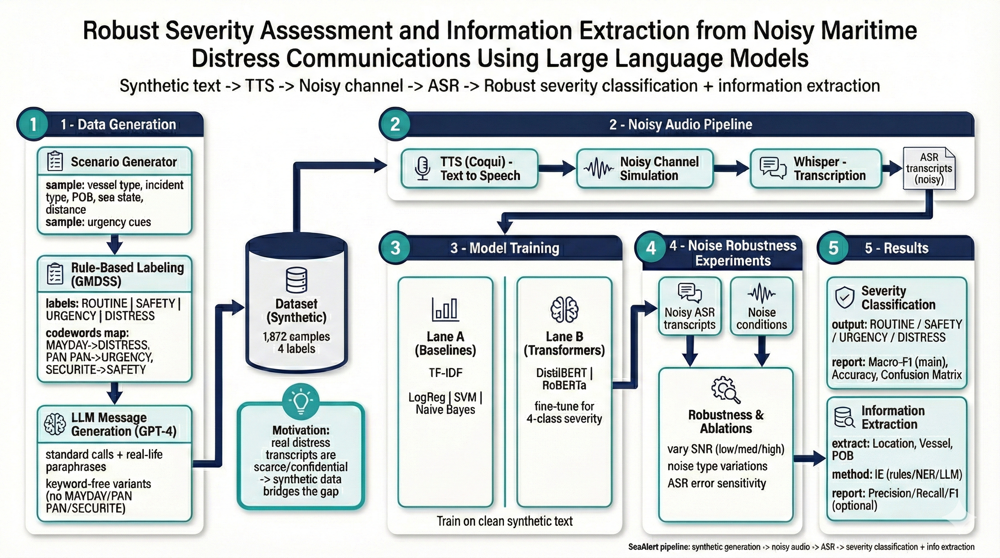

# SeaAlert 
## Maritime Radio Call Classification & Information Extraction

> **Classifying noisy ASR transcriptions of maritime calls and extracting actionable information for rescue coordination.**

## Table of Contents

- [Project Goal](#project-goal)
- [Quick Example](#quick-example)
- [Classification Task](#classification-task)
- [Key Results](#key-results)
- [Pipeline](#pipeline)
- [Project Structure](#project-structure)
- [Notebooks](#notebooks)
- [Dataset](#dataset)
- [Experiments](#experiments)
- [Installation](#installation)
- [Quick Start](#quick-start)

---

##  Project Goal

**SeaAlert** is an NLP system designed to:
1. **Classify** maritime radio distress calls into 4 severity levels (Distress, Urgency, Safety, Routine)
2. **Extract** actionable information (Location, Vessel Name, Persons on Board, Nature of Incident)

### The Real-World Challenge

Maritime distress calls are made under extreme conditions:
- **High Noise Environment** — Engine noise, storms, VHF static interference
- **Human Stress** — Panic causes operators to omit keywords or speak informally
- **Protocol Violations** — Not all distress calls follow GMDSS standards ("MAYDAY", "PAN PAN")

**Therefore, my classification model must handle very noisy ASR (Automatic Speech Recognition) transcriptions**, not clean text. This is the core challenge of my project.

### My Approach: Dual Augmentation

We tackle this challenge using **two augmentation techniques**:
1. **LLM-based Text Generation** — GPT-4 generates diverse maritime messages (formal, informal, protocol violations)
2. **ASR-based Augmentation** — Text → TTS → Noisy Audio → Whisper ASR → Corrupted Text

This creates realistic training data that mimics real-world maritime communication failures.



---

##  Quick Example

Here's a **real example from my dataset** — demonstrating how severe ASR errors can be under high noise conditions:

| Stage | Content |
|-------|---------|
| **Original Message** | *"**MAYDAY, MAYDAY, MAYDAY!** This is the sailing yacht '**Wind Whisper**', uh, we're, um, having a steering failure—can't control the rudder. We're drifting, uh, southeast of, uh, **Cape Cod**, um, about **10 nautical miles off the shore**, I think. Weather's, uh, kinda rough, waves are, like, 3 meters, and it's, um, getting windy. We've got, uh, three people onboard. Need assistance, like, right now! Over."* |
| **ASR Output (High Noise)** | *"**maybe, maybe, maybe**, this is the sailing yacht **with this boat out here**, I'm having a steering failure, can't control the rudder, we drifting, I've surfaced through, I **kick hard**, I'm about **10 knots, I come out as off as sure** I think, where those are, can't laugh, waves are like three meters, and it's, I'm getting in the, we've got a few people on board, need the systems right right now, over."* |
| **Classification** | 🔴 **DISTRESS** |
| **Extracted Information** | `Vessel: NONE` · `Location:NONE` · `POB: NONE` · `Nature: Steering failure, drifting` |

**Critical ASR Errors Shown:**
- `MAYDAY, MAYDAY, MAYDAY` → `maybe, maybe, maybe` 🔴 **(codeword completely lost!)**
- `Wind Whisper` → `with this boat out here` (vessel name destroyed)
- `Cape Cod` → `kick hard` (location corrupted)
- `nautical miles off the shore` → `knots, I come out as off as sure` (nonsensical)

Despite these **catastrophic ASR errors** — where the critical MAYDAY codeword became "maybe" — my Transformer model correctly classifies the message as DISTRESS based on contextual understanding of phrases like "steering failure", "can't control", "drifting", and "need assistance".

---

## Classification Task

SeaAlert classifies messages into 4 severity labels based on GMDSS protocol:

| Label | Codeword | Description |
|-------|----------|-------------|
| **Distress** | MAYDAY | Life-threatening emergencies requiring immediate assistance |
| **Urgency** | PAN PAN | Urgent situations not immediately life-threatening |
| **Safety** | SECURITE | Navigation hazards, weather warnings |
| **Routine** | NONE | Regular communications, radio checks |

---

## Information Extraction

Beyond classification, **SeaAlert** extracts structured, actionable data from unstructured messages:

| Field | Description | Example |
|-------|-------------|---------|
| **Vessel Name** | Name of the ship in distress | `Ocean Explorer` |
| **Call Sign / MMSI** | Unique radio identifiers | `WXYZ123` / `123456789` |
| **Location** | Coordinates or relative position | `34°15'N, 120°45'W` |
| **POB** | Persons On Board (Count) | `15` |
| **Nature** | Type of incident | `Sinking`, `Fire`, `Medical` |

This structured output is critical for rescue coordination centers to dispatch appropriate resources.

---

## Key Results

### Transformer Model Selection

Two transformer models were evaluated on the validation set:

| Model | Parameters | Validation F1 | Selected |
|-------|------------|---------------|----------|
| DistilBERT | 66M | 0.679 | ❌ |
| **RoBERTa** | 125M | **0.734** | ✅ |

**RoBERTa was selected** for all experiments due to its superior validation performance (+5.5% F1).

### Final Model Comparison

| Model | Type | Clean F1 | ASR-High F1 | Trap F1 | ASR Robustness |
|-------|------|----------|-------------|---------|----------------|
| Logistic Regression | Baseline | 0.674 | 0.423 | 0.139 | -37% drop |
| Linear SVM | Baseline | 0.686 | - | - | - |
| Naive Bayes | Baseline | 0.592 | - | - | - |
| **RoBERTa** | Transformer | 0.664 | **0.569** | **0.236** | **-14% drop** |

### Key Findings

1. **ASR Robustness** — RoBERTa maintains better performance on noisy ASR transcripts:
   - BoW: 67.4% → 42.3% F1 (37% degradation)
   - RoBERTa: 66.4% → 56.9% F1 (**only 14% degradation**)

2. **Codeword Reliance** — Both models rely heavily on GMDSS keywords:
   - With codeword: 100% accuracy (both models)
   - Without codeword: ~51% accuracy (both models)

3. **Adversarial Robustness** — RoBERTa handles tricky cases better:
   - Negations: "This is NOT a distress"
   - Drills: "MAYDAY - this is a drill"
   - RoBERTa: 23.6% F1 vs BoW: 13.9% F1 (70% improvement)

4. **Data Augmentation** — Training with ASR-corrupted text improves robustness:
   - BoW with ASR augmentation: 58.9% F1 on ASR-high (vs 42.3% without)

---

## Pipeline

My end-to-end pipeline simulates real maritime communication:

```
┌─────────────────────────────────────────────────────────────────────────┐
│                        SeaAlert Pipeline                                │
├─────────────────────────────────────────────────────────────────────────┤
│                                                                         │
│  ┌──────────────┐    ┌──────────────┐    ┌──────────────┐              │
│  │   GPT-4      │    │  Coqui TTS   │    │ Noise Layer  │              │
│  │  Generation  │───▶│  Synthesis   │───▶│  (VHF Radio) │              │
│  │ 1,872 msgs   │    │   16kHz      │    │ 6/12/18 dB   │              │
│  └──────────────┘    └──────────────┘    └──────────────┘              │
│         │                                       │                       │
│         ▼                                       ▼                       │
│  ┌──────────────┐                      ┌──────────────┐                │
│  │ Clean Text   │                      │ Whisper ASR  │                │
│  │  Dataset     │                      │ Transcription│                │
│  └──────────────┘                      └──────────────┘                │
│         │                                       │                       │
│         └───────────────┬───────────────────────┘                       │
│                         ▼                                               │
│              ┌─────────────────────┐                                    │
│              │   Model Training    │                                    │
│              │  BoW vs Transformer │                                    │
│              └─────────────────────┘                                    │
│                         │                                               │
│         ┌───────────────┼───────────────┐                               │
│         ▼               ▼               ▼                               │
│  ┌─────────────┐ ┌─────────────┐ ┌─────────────┐                       │
│  │ Exp 1:      │ │ Exp 2:      │ │ Exp 3:      │                       │
│  │ Codeword    │ │ Adversarial │ │ ASR         │                       │
│  │ Masking     │ │ Traps       │ │ Robustness  │                       │
│  └─────────────┘ └─────────────┘ └─────────────┘                       │
│                         │                                               │
│                         ▼                                               │
│              ┌─────────────────────┐                                    │
│              │ Classification +    │                                    │
│              │ Info Extraction     │                                    │
│              └─────────────────────┘                                    │
│                                                                         │
└─────────────────────────────────────────────────────────────────────────┘
```

| Stage | Description | Output |
|-------|-------------|--------|
| **1. Data Generation** | GPT-4 synthetic maritime messages | 1,872 balanced samples |
| **2. Text-to-Speech** | Coqui TTS audio synthesis | WAV files (16kHz) |
| **3. Noise Simulation** | VHF radio noise at 3 SNR levels | Noisy audio files |
| **4. ASR Transcription** | Faster-Whisper speech-to-text | Corrupted text transcripts |
| **5. Model Training** | BoW baselines + RoBERTa transformer | Trained classifiers |
| **6. Evaluation** | 3 experiments + information extraction | Results & analysis |

---

## Project Structure

```
SeaAlert/
├── notebooks/                          # Jupyter notebooks (run in order)
│   ├── 00_eda_dataset.ipynb            # EDA for synthetic dataset
│   ├── 00_eda_audio_asr.ipynb          # EDA for audio & ASR quality
│   ├── 01_generate_synthetic_dataset.ipynb   # GPT-4 data generation
│   ├── 02_text_to_speech.ipynb         # Coqui TTS synthesis
│   ├── 03_noise_and_asr.ipynb          # Noise injection + Whisper ASR
│   ├── 04_train_and_evaluate.ipynb     # Model training & experiments
│   └── 05_demo_inference_and_extraction.ipynb  # Demo & extraction
│
├── data/                               # Datasets
│   ├── processed/
│   │   ├── 02seaalert.csv              # Main dataset (clean text)
│   │   └── 03seaalert_with_asr.csv     # Dataset with ASR transcripts
│   ├── asr/
│   │   └── asr_transcripts.csv         # Whisper raw transcripts
│   └── audio_*/                        # Audio index files
│       └── *_index.csv
│
├── results/                            # Results & visualizations
│   ├── all_model_results.csv           # Consolidated model results
│   ├── wer_report.csv                  # Word Error Rate analysis
│   ├── split_indices.csv               # Train/val/test splits
│   └── *.png                           # Visualizations
│
├── archive/                            # Previous project versions
│
├── pipeline_diagram.png                # Pipeline visualization
├── .gitignore                          # Git ignore rules
└── README.md                           # This file
```

---

## Notebooks

### 1. Exploratory Data Analysis

#### 00_eda_dataset.ipynb
- Label/style/scenario distributions
- Text length analysis
- Codeword presence analysis
- Word clouds by severity label

#### 00_eda_audio_asr.ipynb
- Audio duration distributions
- Spectrogram visualizations
- WER (Word Error Rate) by noise level
- Codeword preservation in ASR

---

### 2. Data Generation & Audio Pipeline

#### 01_generate_synthetic_dataset.ipynb
Generates 1,872 synthetic maritime messages using GPT-4.

**Features:**
- 4 balanced classes: 468 samples each
- 3 communication styles: formal, informal, third_party
- 12 scenario types: water_ingress, fire_smoke, medical_issue, etc.
- Codeword masking for experiments
- Stratified train/val/test splits (70/15/15)

#### 02_text_to_speech.ipynb
Converts text to speech using Coqui TTS.

**Model:** `tts_models/en/ljspeech/tacotron2-DDC`  
**Output:** 1,872 WAV files (16kHz mono)

#### 03_noise_and_asr.ipynb
Adds realistic VHF radio noise and transcribes with Whisper.

| Noise Level | SNR | WER | Characteristics |
|-------------|-----|-----|-----------------|
| Low | 18dB | ~15% | Light static |
| Med | 12dB | ~20% | Moderate static, some dropouts |
| High | 6dB | ~25% | Heavy static, frequent dropouts |

---

### 3. Training & Evaluation

#### 04_train_and_evaluate.ipynb
Main training notebook with comprehensive experiments.

**Models:**
| Model | Library | Notes |
|-------|---------|-------|
| TF-IDF + LogReg | scikit-learn | Baseline |
| TF-IDF + SVM | scikit-learn | Baseline |
| TF-IDF + NaiveBayes | scikit-learn | Baseline |
| DistilBERT | HuggingFace | Evaluated (66M params) |
| RoBERTa-base | HuggingFace | **Selected** (125M params) |

**Experiments:**
1. Codeword Masking — Tests reliance on GMDSS keywords
2. Adversarial Traps — Negations, drills, resolved incidents
3. ASR Robustness — Performance on noisy transcripts

---

### 4. Demo & Extraction

#### 05_demo_inference_and_extraction.ipynb
End-to-end demonstration:
- Classify messages with trained RoBERTa model
- Compare original vs ASR-corrupted text
- Extract structured information (vessel, location, POB)
- Generate visual rescue reports

---

## Dataset

### Schema (02seaalert.csv)

| Column | Type | Description |
|--------|------|-------------|
| `idx` | int | Unique sample index (0-1871) |
| `text` | str | Original message text |
| `label` | str | Routine / Safety / Urgency / Distress |
| `style` | str | formal / informal / third_party |
| `scenario_type` | str | water_ingress, fire_smoke, etc. |
| `has_codeword` | bool | Contains MAYDAY/PAN PAN/SECURITE |
| `codeword` | str | MAYDAY / PAN PAN / SECURITE / NONE |
| `text_masked` | str | Codewords replaced by [SIGNAL] |
| `vessel` | str | Vessel name |
| `call_sign` | str | Radio call sign |
| `mmsi` | str | MMSI number (9 digits) |
| `location` | str | Position/coordinates |
| `pob` | int | Persons on board |
| `nature` | str | Nature of incident |

### Statistics
- **Total samples:** 1,872
- **Labels:** 468 per class (perfectly balanced)
- **With codeword:** ~35%
- **Text length:** 35-129 words (avg: 79)

---

## Experiments

### Experiment 1: Codeword Masking

Tests if models rely on GMDSS codewords or understand context.

| Setting | Train Data | Test Data | BoW F1 | RoBERTa F1 |
|---------|------------|-----------|--------|------------|
| A (Clean) | text | text | 0.674 | 0.664 |
| B (Masked) | masked | masked | 0.565 | 0.520 |
| C (Transfer) | text | masked | 0.444 | 0.520 |

**Finding:** Both models rely heavily on codewords. RoBERTa shows better transfer to masked text.

### Experiment 2: Adversarial Traps

Tests with samples designed to fool keyword-based models:
- **Negation:** "This is NOT a distress"
- **Drills:** "MAYDAY - this is a drill"
- **Past incidents:** "Distress was resolved yesterday"

| Model | Trap Accuracy | Trap F1 |
|-------|---------------|---------|
| BoW | 26.7% | 0.139 |
| RoBERTa | 33.3% | 0.236 |

**Finding:** Both struggle, but RoBERTa performs ~70% better.

### Experiment 3: ASR Robustness

Tests performance on Whisper-transcribed noisy audio.

| Model | Clean F1 | ASR-Med F1 | ASR-High F1 | Degradation |
|-------|----------|------------|-------------|-------------|
| BoW | 0.674 | 0.427 | 0.423 | -37% |
| RoBERTa | 0.664 | 0.605 | 0.569 | **-14%** |
| BoW (augmented) | - | - | 0.589 | - |

**Finding:** RoBERTa is significantly more robust to ASR noise. Data augmentation helps BoW.

---

## Installation

### Google Colab (Recommended)
Each notebook auto-installs dependencies. Just run the first cell.

### Local Development
```bash
# Core
pip install pandas numpy tqdm scikit-learn matplotlib joblib

# Text generation
pip install openai jsonschema

# TTS & Audio
pip install TTS soundfile librosa scipy

# ASR
pip install faster-whisper

# Transformers
pip install transformers datasets evaluate accelerate torch
```

---

## Quick Start

### 1. Clone Repository
```bash
git clone https://github.com/your-repo/SeaAlert.git
cd SeaAlert
```

### 2. Set API Key (for LLM features)
```python
# Create src/API_KEY.py
OPENAI_API_KEY = "sk-your-key-here"
```

### 3. Run Notebooks in Order
```
01_generate_synthetic_dataset.ipynb  →  Generate data
02_text_to_speech.ipynb              →  Create audio
03_noise_and_asr.ipynb               →  Add noise & transcribe
04_train_and_evaluate.ipynb          →  Train & evaluate
05_demo_inference_and_extraction.ipynb  →  Demo
```

### Quick Run Mode (No API)
Set `QUICK_RUN = True` in Notebook 01 for template-based data.

---

## License

Educational project for NLP course.

---

## Acknowledgments

- [Coqui TTS](https://github.com/coqui-ai/TTS) - Text-to-Speech synthesis
- [Faster Whisper](https://github.com/guillaumekln/faster-whisper) - ASR transcription
- [HuggingFace Transformers](https://huggingface.co/) - RoBERTa model
- OpenAI GPT-4 - Synthetic data generation
