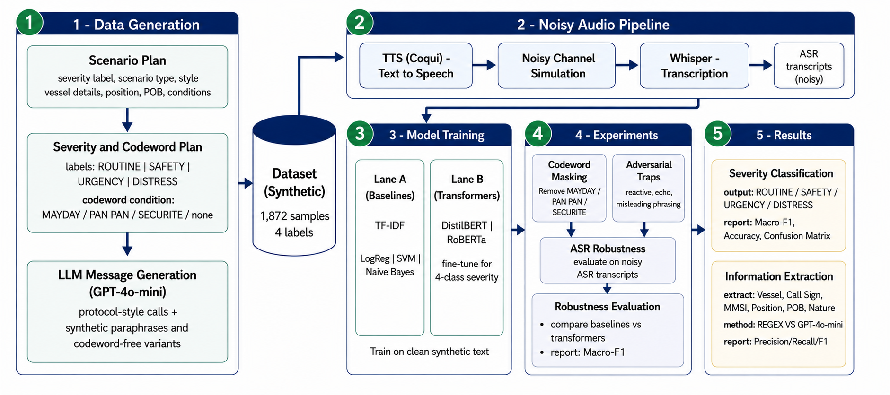

# SeaAlert


**Critical Information Extraction From Maritime Distress Communications with Large Language Models**

*Tomer Atia<sup>1</sup>, Yehudit Aperstein<sup>2</sup>, Alexander Apartsin<sup>1</sup>*

<sup>1</sup> HIT-Holon Institute of Technology &nbsp;|&nbsp; <sup>2</sup> Afeka Academic College of Engineering

---

## Table of Contents

- [Overview](#overview)
- [Key Features](#key-features)
- [Pipeline](#pipeline)
- [Key Results](#key-results)
- [Dataset](#dataset)
- [Installation & Usage](#installation--usage)
- [Repository Structure](#repository-structure)
- [Citation](#citation)

---

## Overview

SeaAlert is an end-to-end NLP framework for classifying maritime VHF distress messages by severity and extracting structured operational fields — even when the audio is heavily degraded by noise and ASR errors.

Real-world maritime communication is noisy, brief, and often deviates from the GMDSS standard format. Traditional keyword-spotting systems break down when codewords like MAYDAY are corrupted or omitted. SeaAlert addresses this by building a full pipeline: from LLM-generated synthetic data and simulated VHF audio, through ASR transcription, to robust classification and information extraction.

## Key Features

- **Synthetic dataset** of 1,872 messages generated by GPT-4 — balanced across 4 severity classes, 3 communication styles, and 12 maritime scenarios
- **Audio simulation** using Coqui TTS (109 speakers) + VHF noise injection at two SNR levels (12 dB / 6 dB)
- **ASR transcription** via Whisper, with WER analysis at each noise level
- **Classification** comparing BoW baselines (TF-IDF + Logistic Regression) vs. RoBERTa transformer
- **Robustness experiments**: ASR noise degradation, codeword masking, and adversarial trap messages
- **Structured extraction** comparing Regex vs. GPT-4 for fields like vessel name, MMSI, position, and POB

---

## Pipeline



---

## Key Results

### Classification Robustness

| Model | Clean F1 | ASR High F1 | Relative Drop |
|---|---|---|---|
| Logistic Regression (BoW) | 0.674 | 0.423 | **−37%** |
| RoBERTa | 0.679 | 0.608 | **−10%** |

- Both models perform similarly on clean text (~F1 0.68), but **RoBERTa degrades 4× less** under high ASR noise
- The Safety class is the most fragile: BoW F1 drops **0.60 points** under ASR high noise — effectively blind to Safety messages
- Both models rely heavily on GMDSS codewords (MAYDAY/PAN-PAN/SECURITE); performance without a codeword drops to near-chance
- **Neither model handles drill messages** (0% accuracy) — human-in-the-loop is required for production deployment

### Structured Extraction (Regex vs. GPT-4 at ASR High Noise)

| Field | Regex | GPT-4 | Gain |
|---|---|---|---|
| MMSI | 0.015 | 0.239 | +1493% |
| Call Sign | 0.040 | 0.273 | +583% |
| Position | 0.083 | 0.323 | +289% |
| POB | 0.305 | 0.796 | +161% |
| Vessel | 0.465 | 0.627 | +35% |

- **GPT-4 outperforms Regex on every field** — gains range from +35% to +1493%
- Regex collapses on alphanumeric fields (MMSI, Call Sign) because ASR fragments characters; GPT-4 reconstructs them from context
- For noisy ASR pipelines, **LLM-based extraction is the only viable approach**

---

## Dataset

| Property | Value |
|---|---|
| Total messages | 1,872 |
| Severity classes | Distress, Urgency, Safety, Routine (468 each) |
| Communication styles | formal, informal, third_party |
| Scenarios | 12 (engine failure, fire, flooding, collision, etc.) |
| Train / Val / Test | 1,310 / 281 / 281 (stratified) |

---

## Installation & Usage

### 1. Clone the repository

```bash
git clone https://github.com/tomeratia/SeaAlert.git
cd SeaAlert
```

### 2. Install dependencies

```bash
pip install pandas numpy tqdm scikit-learn matplotlib joblib
pip install openai jsonschema
pip install TTS soundfile librosa scipy
pip install faster-whisper
pip install transformers datasets evaluate accelerate torch
```

### 3. Set your OpenAI API key

Create `src/API_KEY.py`:

```python
OPENAI_API_KEY = "your-key-here"
```

### 4. Run the notebooks in order

```bash
# 1. Generate synthetic dataset (set QUICK_RUN=True to skip GPT-4 call)
jupyter notebook notebooks/01_generate_synthetic_dataset.ipynb

# 2. Text-to-speech synthesis
jupyter notebook notebooks/02_text_to_speech.ipynb

# 3. Noise injection + ASR transcription
jupyter notebook notebooks/03_noise_and_asr.ipynb

# 4. Train and evaluate all models
jupyter notebook notebooks/04_train_and_evaluate.ipynb

# 5. Demo inference and field extraction
jupyter notebook notebooks/05_demo_inference_and_extraction.ipynb
```

> **Note:** Notebooks are designed for Google Colab and auto-install their dependencies. For local use, install manually as above.

### Quick inference example

```python
from transformers import pipeline

classifier = pipeline(
    "text-classification",
    model="models/best_transformer/",
    return_all_scores=True
)

text = "MAYDAY MAYDAY MAYDAY. This is vessel Sea Breeze. Engine fire, taking on water. 3 POB. Position 32N 34E."
result = classifier(text)
print(result)
# [{'label': 'Distress', 'score': 0.97}, ...]
```

---

## Repository Structure

```
SeaAlert/
├── notebooks/
│   ├── 00_eda_dataset.ipynb
│   ├── 00_eda_audio_asr.ipynb
│   ├── 01_generate_synthetic_dataset.ipynb
│   ├── 02_text_to_speech.ipynb
│   ├── 03_noise_and_asr.ipynb
│   ├── 04_train_and_evaluate.ipynb
│   └── 05_demo_inference_and_extraction.ipynb
├── data/
│   ├── processed/
│   ├── audio_clean/
│   └── audio_noisy/
├── results/
```

---

## Citation

```bibtex
@article{seaalert2026,
  title        = {SeaAlert: Severity Assessment and Critical Information Extraction in Maritime Distress Communications Using LLM-Generated Data},
  author       = {Atia, Tomer and Aperstein, Yehudit and Apartsin, Alexander},
  year         = {2026},
  howpublished = {\url{https://github.com/tomeratia/SeaAlert}},
  note         = {HIT-Holon Institute of Technology \& Afeka Academic College of Engineering}
}
```
