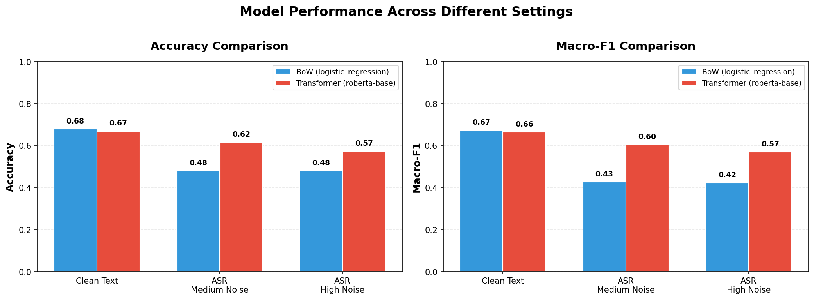
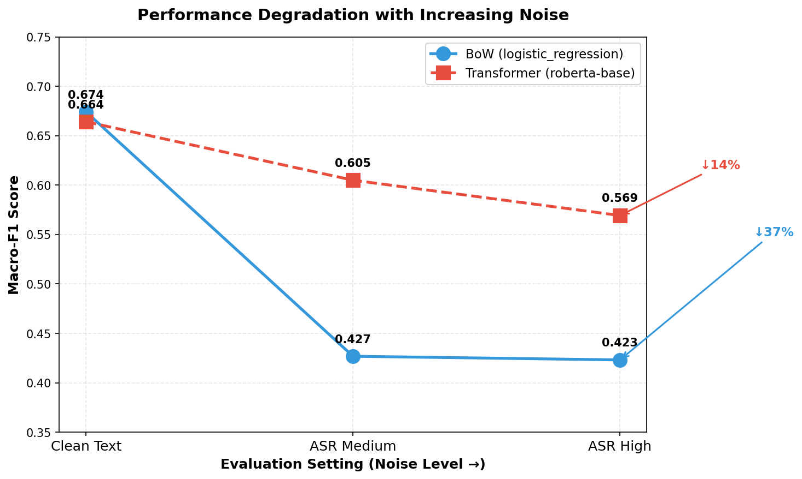
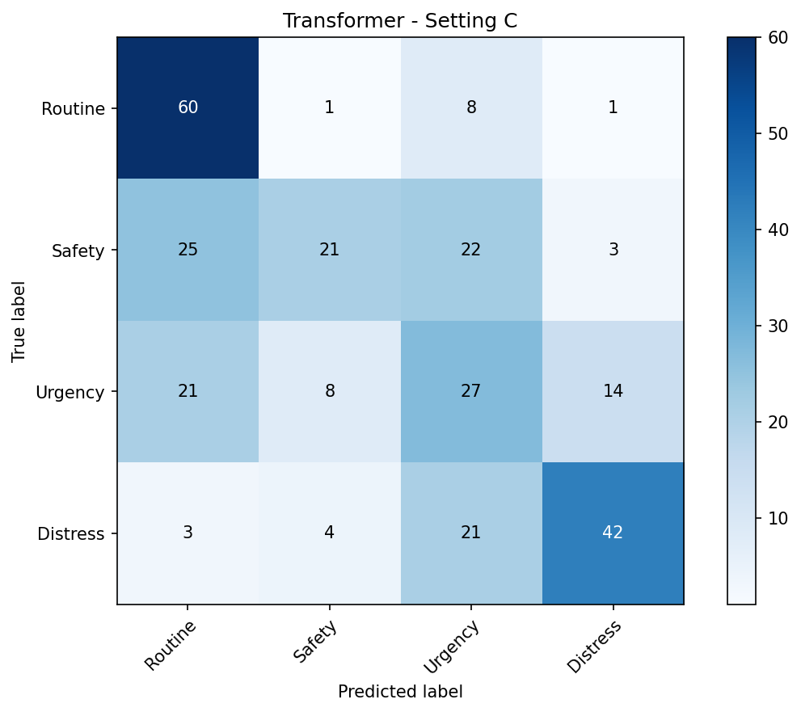

# SeaAlert - Maritime Message Classification System

A comprehensive NLP project for classifying maritime radio/VHF/GMDSS messages into severity levels, comparing traditional Machine Learning (Bag-of-Words) approaches with modern Transformer models (RoBERTa).

## Table of Contents

- [Project Overview](#project-overview)
- [Key Results](#key-results)
- [Pipeline](#pipeline)
- [Project Structure](#project-structure)
- [Notebooks](#notebooks)
- [Dataset](#dataset)
- [Experiments](#experiments)
- [Installation](#installation)
- [Quick Start](#quick-start)
- [API Key Configuration](#api-key-configuration)

---

## Project Overview

**SeaAlert** is an advanced NLP system designed to automate the classification and information extraction of maritime radio distress calls. In the maritime domain, rapid and accurate understanding of distress signals can mean the difference between life and death.

This project addresses a critical gap in maritime safety by moving beyond traditional keyword-based systems to state-of-the-art Deep Learning models capable of understanding context, handling noisy audio transcripts, and extracting vital information (location, vessel name, nature of distress) automatically.

### Background & Motivation

Maritime communication relies heavily on **VHF radio (Very High Frequency)** and the **GMDSS (Global Maritime Distress and Safety System)** protocol. While GMDSS defines specific keywords (MAYDAY, PAN PAN, SECURITE), real-world communications are often chaotic:
*   **Human Error:** Panic can lead operators to omit keywords or speak informally.
*   **Environmental Noise:** Storms, engine noise, and static interference degrade audio quality.
*   **Ambiguity:** A message about a "drill" or a "negated" distress ("We are *not* in distress") can easily fool simple systems.

### The Challenge

Traditional systems typically rely on simple **Keyword Spotting (KWS)** — if "MAYDAY" is detected, an alarm triggers. However, this approach fails when:
1.  **Keywords are missing:** "We are sinking, send help!" (Implied Distress).
2.  **Context negates variables:** "This is a TEST of the Mayday system." (False Positive).
3.  **ASR Errors:** "Mayday" might be transcribed as "May day" or "My day" due to static noise.

**SeaAlert** tackles these challenges by comparing robust **Transformer models (RoBERTa)** against traditional **Bag-of-Words** baselines, proving that deep contextual understanding is essential for reliable maritime safety systems.

---

### Classification Task
SeaAlert classifies messages into 4 severity labels:

| Label | Codeword | Description |
|-------|----------|-------------|
| **Distress** | MAYDAY | Life-threatening emergencies requiring immediate assistance |
| **Urgency** | PAN PAN | Urgent situations not immediately life-threatening |
| **Safety** | SECURITE | Navigation hazards, weather warnings |
| **Routine** | NONE | Regular communications, radio checks |

### Key Features

-  **Synthetic Data Generation** - LLM-powered dataset creation with 1,872 samples
-  **Text-to-Speech** - Convert messages to audio using Coqui TTS
-  **Radio Noise Simulation** - Add realistic VHF radio noise at 3 SNR levels
-  **ASR Transcription** - Whisper-based speech-to-text
-  **Model Comparison** - BoW baselines vs RoBERTa Transformer
-  **Robustness Experiments** - Codeword masking, ASR noise, adversarial traps
-  **Information Extraction** - Regex-based structured data extraction

---

## Key Results

### Transformer Model Selection

Two transformer models were evaluated on the validation set:

| Model | Parameters | Validation F1 | Selected |
|-------|------------|---------------|----------|
| DistilBERT | 66M | 0.679 | ❌ |
| **RoBERTa** | 125M | **0.734** | ✅ |

**RoBERTa was selected** for all subsequent experiments due to its superior validation performance (+5.5% F1).

### Final Model Comparison

| Model | Type | Clean Acc | Clean F1 | ASR-High F1 | Trap F1 |
|-------|------|-----------|----------|-------------|---------|
| Logistic Regression | Baseline | 68.0% | 0.674 | 0.423 | 0.139 |
| Linear SVM | Baseline | 69.0% | 0.686 | - | - |
| Naive Bayes | Baseline | 59.1% | 0.592 | - | - |
| **RoBERTa** | Transformer | **66.9%** | **0.664** | **0.569** | **0.236** |

*Note: Experiments (ASR robustness, Trap set) were conducted only on RoBERTa as the selected transformer model.*

### Key Findings

1. **Codeword Reliance**: Both models show significant accuracy gaps between samples with/without codewords:
   - BoW: 100% with codeword vs 52.6% without (gap: 47.4%)
   - RoBERTa: 100% with codeword vs 51.1% without (gap: 48.9%)

2. **ASR Robustness**: RoBERTa maintains better performance on noisy ASR transcripts:
   - BoW drops from 67.4% → 42.3% F1 on high-noise ASR
   - RoBERTa drops from 66.4% → 56.9% F1 (more robust)

3. **Adversarial Samples**: Both models struggle with trap samples, but RoBERTa performs better (23.6% vs 13.9% F1)

4. **Data Augmentation**: Training with ASR-augmented data improves robustness (58.9% F1 on ASR-high vs 42.3%)

---

## Information Extraction Capabilities

Beyond classification, **SeaAlert** converts unstructured text into actionable structured data using a hybrid approach (Regex + LLM). This is critical for rescue coordination centers.

| Field | Description | Example |
|-------|-------------|---------|
| **Vessel Name** | Name of the ship in distress | `Ocean Explorer` |
| **Call Sign / MMSI** | Unique radio identifiers | `WXYZ123` / `123456789` |
| **Location** | Coordinates or relative position | `34°15'N, 120°45'W` |
| **POB** | Persons On Board (Count) | `15` |
| **Nature** | Type of incident | `Sinking`, `Fire`, `Medical` |

*Demonstrated in Notebook 05: The system takes a raw audio transcript and outputs a JSON object ready for operational use.*

---

## Pipeline


| Stage | Description |
|-------|-------------|
| **1. Data Generation** | Synthetic maritime messages via GPT-4 (1,872 samples, 4 labels) |
| **2. Audio Pipeline** | TTS → Noise (3 SNR levels) → ASR (Whisper) |
| **3. Model Training** | BoW (TF-IDF + LogReg/SVM/NB) and Transformer (RoBERTa) |
| **4. Experiments** | Codeword Masking, Adversarial Traps, ASR Robustness |
| **5. Evaluation** | Accuracy, Macro-F1, Confusion Matrices, Error Analysis |

---

## Project Structure

```
SeaAlert/
├── notebooks/                      # Jupyter notebooks
│   ├── 00_eda_dataset.ipynb        # EDA for synthetic dataset
│   ├── 00_eda_audio_asr.ipynb      # EDA for audio & ASR
│   ├── 01_generate_synthetic_dataset.ipynb  # Data generation
│   ├── 02_text_to_speech .ipynb    # TTS synthesis
│   ├── 03_noise_and_asr.ipynb      # Noise + Whisper ASR
│   ├── 04_train_and_evaluate .ipynb  # Model training & experiments
│   └── 05_demo_inference_and_extraction.ipynb  # Demo & extraction
│
├── data/                           # Datasets
│   ├── processed/
│   │   ├── 02seaalert.csv          # Main dataset
│   │   └── 03seaalert_with_asr.csv # Dataset with ASR transcripts
│   ├── asr/
│   │   └── asr_transcripts.csv     # Whisper raw transcripts
│   └── audio_*/                    # Index files
│       └── *_index.csv
│
├── results/                        # Results & visualizations
│   ├── all_model_results.csv       # Consolidated results
│   ├── results_*.csv               # Experiment results
│   ├── wer_report.csv              # Word Error Rate report
│   ├── split_indices.csv           # Train/val/test splits
│   ├── eda_*.png                   # EDA visualizations
│   ├── cm_*.png                    # Confusion matrices
│   ├── model_comparison_bars.png   # Model comparison chart
│   └── performance_*.png           # Performance visualizations
│
├── .gitignore                      # Git ignore rules
├── pipeline_diagram.png            # Pipeline visualization
└── README.md                       # This file
```

---

## Notebooks

### 1. Data Generation

#### 01_generate_synthetic_dataset.ipynb
Generates 1,872 synthetic maritime messages using GPT-4.

**Key Features:**
- Balanced labels: 468 samples per class (Routine, Safety, Urgency, Distress)
- 3 communication styles: formal, informal, third_party
- 12 scenario types: water_ingress, fire_smoke, medical_issue, etc.
- Codeword masking for experiments
- Stratified train/val/test splits (70/15/15)

**Outputs:** `02seaalert.csv`, `split_indices.csv`

---

### 2. Audio Pipeline

#### 02_text_to_speech .ipynb
Converts text to speech using Coqui TTS.

**Model:** `tts_models/en/ljspeech/tacotron2-DDC`  
**Output:** 1,872 WAV files (16kHz)

#### 03_noise_and_asr.ipynb
Adds radio noise and transcribes with Whisper.

**Noise Levels:**
| Level | SNR | Characteristics |
|-------|-----|-----------------|
| Low | 18dB | Light static, minimal dropouts |
| Med | 12dB | Moderate static, some dropouts |
| High | 6dB | Heavy static, frequent dropouts |

**ASR Model:** `faster-whisper` (base)  
**Average WER:** Low ~15%, Med ~20%, High ~25%

---

### 3. Exploratory Data Analysis

#### 00_eda_dataset.ipynb
Dataset analysis with visualizations:
- Label/style/scenario distributions
- Text length analysis
- Codeword presence analysis
- Word clouds by label

#### 00_eda_audio_asr.ipynb
Audio & ASR analysis:
- Audio duration distributions
- Spectrogram examples
- WER analysis by noise level
- Codeword preservation in ASR

---

### 4. Training & Evaluation

#### 04_train_and_evaluate .ipynb
Main training notebook with 3 experiments.

**Models Trained:**
| Model | Library | Parameters | Status |
|-------|---------|------------|--------|
| TF-IDF + LogReg | scikit-learn | C=1.0 | Baseline |
| TF-IDF + SVM | scikit-learn | C=1.0, linear | Baseline |
| TF-IDF + NaiveBayes | scikit-learn | - | Baseline |
| DistilBERT | HuggingFace | 66M params | Evaluated |
| RoBERTa-base | HuggingFace | 125M params | **Selected** |

**Experiments:**
1. **Masking Experiment** - Tests codeword reliance
2. **Trap Set** - Tests with adversarial samples
3. **ASR Robustness** - Tests on noisy transcripts

---

### 5. Demo & Extraction

#### 05_demo_inference_and_extraction.ipynb
Demo of classification and information extraction.

**Features:**
- Classify messages with RoBERTa
- Compare original vs ASR-corrupted text
- Extract structured info: vessel, position, POB, nature, etc.
- Visual report generation

---

## Dataset

### Schema (02seaalert.csv)

| Column | Type | Description |
|--------|------|-------------|
| `idx` | int | Unique sample index (0-1871) |
| `text` | str | Original message text |
| `label` | str | Routine / Safety / Urgency / Distress |
| `style` | str | formal / informal / third_party |
| `scenario_type` | str | water_ingress, fire_smoke, etc. |
| `has_codeword` | bool | Contains MAYDAY/PAN PAN/SECURITE |
| `codeword` | str | MAYDAY / PAN PAN / SECURITE / NONE |
| `text_masked` | str | Text with codewords replaced by [SIGNAL] |
| `vessel` | str | Vessel name |
| `call_sign` | str | Radio call sign |
| `mmsi` | str | MMSI number (9 digits) |
| `location` | str | Position/coordinates |
| `pob` | int | Persons on board |
| `nature` | str | Nature of incident |

### Statistics

- **Total samples:** 1,872
- **Labels:** 468 per class (perfectly balanced)
- **Styles:** 624 per style (perfectly balanced)
- **With codeword:** ~35%
- **Text length:** 35-129 words (avg: 79)

---

## Experiments

### Experiment 1: Codeword Masking

Tests if models rely on GMDSS codewords or understand context.

| Setting | Train | Test | BoW F1 | RoBERTa F1 |
|---------|-------|------|--------|------------|
| A (Clean) | text | text | 0.674 | 0.664 |
| B (Masked) | masked | masked | 0.565 | 0.520 |
| C (Transfer) | text | masked | 0.444 | 0.520 |

**Finding:** Both models rely heavily on codewords. RoBERTa shows better transfer to masked text.

### Experiment 2: Adversarial Traps

Tests with samples designed to fool keyword-based models:
- Negation: "This is NOT a distress"
- Drills: "MAYDAY - this is a drill"
- Past incidents: "Distress was resolved yesterday"

| Model | Trap Accuracy | Trap F1 |
|-------|---------------|---------|
| BoW | 26.7% | 0.139 |
| RoBERTa | 33.3% | 0.236 |

**Finding:** Both struggle, but RoBERTa performs ~70% better.

### Experiment 3: ASR Robustness

Tests performance on Whisper-transcribed noisy audio.

| Model | Clean F1 | ASR-Med F1 | ASR-High F1 | Drop |
|-------|----------|------------|-------------|------|
| BoW | 0.674 | 0.427 | 0.423 | -37% |
| RoBERTa | 0.664 | 0.605 | 0.569 | -14% |
| BoW (augmented) | - | - | 0.589 | - |

**Finding:** RoBERTa is more robust to ASR noise. Data augmentation helps BoW.

---

## Installation

### Google Colab (Recommended)
Each notebook auto-installs dependencies. Just run the first cell.

### Local Development
```bash
# Core
pip install pandas numpy tqdm scikit-learn matplotlib joblib

# Text generation
pip install openai jsonschema

# TTS
pip install TTS soundfile librosa

# ASR
pip install faster-whisper scipy

# Transformers
pip install transformers datasets evaluate accelerate torch
```

---

## Quick Start

### 1. Clone/Download Project
```bash
git clone https://github.com/your-repo/SeaAlert.git
cd SeaAlert
```

### 2. Set API Key (for LLM features)
```python
# Edit src/API_KEY.py
OPENAI_API_KEY = "sk-your-key-here"
```

### 3. Run Notebooks in Order
1. `01_generate_synthetic_dataset.ipynb` - Generate data
2. `02_text_to_speech .ipynb` - Create audio
3. `03_noise_and_asr.ipynb` - Add noise & transcribe
4. `04_train_and_evaluate .ipynb` - Train & evaluate
5. `05_demo_inference_and_extraction.ipynb` - Demo

### Quick Run Mode (No API)
Set `QUICK_RUN = True` in Notebook 01 for template-based data.

---

## API Key Configuration

OpenAI API is used for:
1. Synthetic data generation (Notebook 01)
2. LLM-based extraction (Notebook 05, optional)

**Option 1:** Edit `src/API_KEY.py`
```python
OPENAI_API_KEY = "sk-your-key"
```

**Option 2:** Environment variable
```bash
export OPENAI_API_KEY="sk-your-key"
```

**Option 3:** No API - use `QUICK_RUN = True`

---

## Results Visualizations

### Model Comparison


### Performance Degradation


### Confusion Matrix (RoBERTa on Masked)


---

## License

Educational project for NLP course.

---

## Author

Created for Natural Language Processing course project.

---

## Acknowledgments

- [Coqui TTS](https://github.com/coqui-ai/TTS)
- [Faster Whisper](https://github.com/guillaumekln/faster-whisper)
- [HuggingFace Transformers](https://huggingface.co/transformers/)
- OpenAI GPT-4 for synthetic data generation
